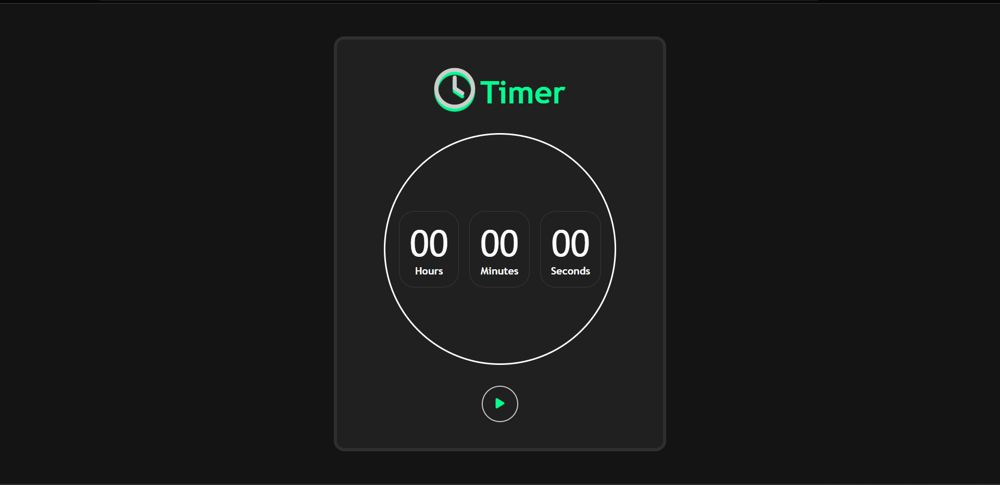

# Timer_simples

Projeto com o objetivo de fazer um timer. Feito com HTML, Sass e JavaScript.

Foto do timer em sua forma inicial:

Foto do timer funcionando quando iniciado:

Foto do timer funcionando quando pausado:

Foto do timer funcionando quando resetado:

Projeto concluído!
