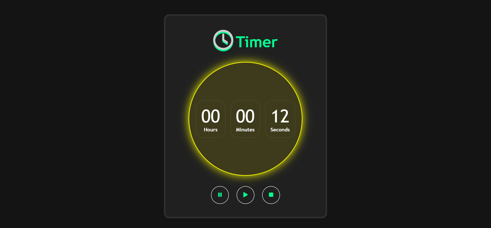
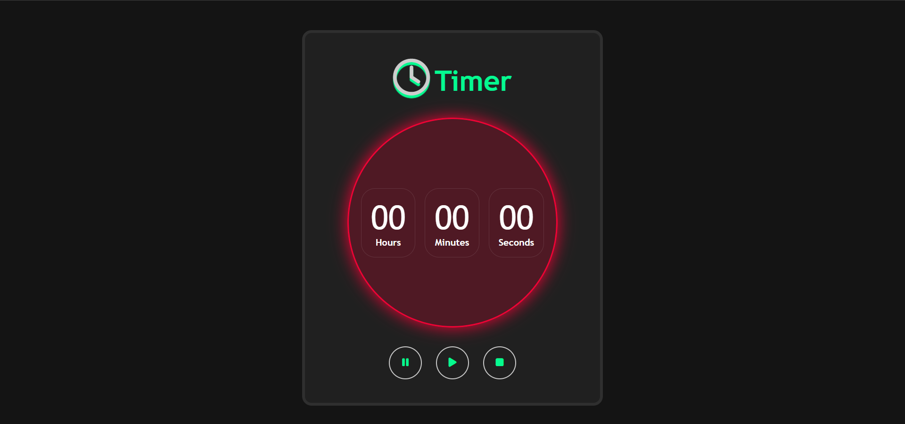

<h1>Sobre o projeto</h1>
 

 

Este projeto foi realizado com o intuito de aprimorar minhas habilidades nas tecnologias HTML, Sass e JavaScript. Consiste no desenvolvimento de um cronômetro (timer) que conta as horas, minutos e segundos. Pode-se considerar de que um projeto como este é analisado como básico e eque esclaresce dúvidas e testa as habilidades de um programador iniciante. 

<h2>Como o timer funciona:</h2>

Resumidamente, este timer funciona a partir da contagem das horas, minutos e segundos. Ao abrir a página do projeto, a pessoa irá se deparar com o timer zerado e com o botão de iniciar. Quando o(a) usuário(a) clicar no botão de iniciar, a contagem irá começar com a seção dos segundos. A cada vez que o timer atingir a marca de sessenta (60) segundos, os minutos serão contados. A cada vez que o timer atingir a marca de sessenta (60) minutos, as horão começarão a ser contadas. Além das funcionalidades técnicas de funcionamento lógico do cronômetro, os botões de pausar, parar e resetar irão aparecer para a pessoa decidir o que fazer com o timer.

<h3>Timer iniciado:</h3>

<h3>Timer pausado:</h3>

<h3>Timer resetado:</h3>

<h2 style="text-align: center">Tecnologias utilizadas no desenvolvimento do projeto:</h2>

  
  
  

Projeto inteiramente realizado por: <b>Aquiles Santos<b>
